# IMTR School Management System - Database ERD

## Entity Relationship Diagram

```mermaid
erDiagram
    USERS {
        int id PK
        string email UK
        string password_hash
        enum role
        enum status
        boolean email_verified
        string email_verification_token
        string password_reset_token
        datetime password_reset_expires
        datetime last_login_at
        int login_attempts
        datetime locked_until
        boolean two_factor_enabled
        string two_factor_secret
        json preferences
        datetime created_at
        datetime updated_at
    }

    PROFILES {
        int id PK
        int user_id FK
        string first_name
        string last_name
        string middle_name
        string phone
        enum gender
        date date_of_birth
        text address
        string city
        string county
        string postal_code
        string national_id UK
        string passport_number UK
        string profile_picture
        string emergency_contact_name
        string emergency_contact_phone
        string emergency_contact_relationship
        text bio
        string website
        string linkedin
        string twitter
        json metadata
        datetime created_at
        datetime updated_at
    }

    STUDENTS {
        int id PK
        int user_id FK
        string student_no UK
        date admission_date
        int program_id FK
        enum status
        int enrollment_year
        date expected_graduation_date
        date actual_graduation_date
        decimal gpa
        decimal cgpa
        int total_credits
        int completed_credits
        enum scholarship_type
        decimal scholarship_amount
        string sponsor_name
        string sponsor_contact
        string parent_guardian_name
        string parent_guardian_phone
        string parent_guardian_email
        string parent_guardian_relationship
        string previous_school
        string previous_qualification
        decimal previous_gpa
        enum clearance_status
        text clearance_notes
        boolean exam_card_issued
        string exam_card_number
        boolean transcript_issued
        string transcript_number
        boolean certificate_issued
        string certificate_number
        json metadata
        datetime created_at
        datetime updated_at
    }

    LECTURERS {
        int id PK
        int user_id FK
        string staff_no UK
        string department
        string specialization
        string qualification
        enum highest_degree
        string institution
        int year_graduated
        date employment_date
        enum employment_type
        enum status
        string salary_scale
        string office_location
        string office_phone
        string office_hours
        text research_interests
        json publications
        json awards
        json certifications
        json languages
        int teaching_experience_years
        int industry_experience_years
        int supervisor_id FK
        boolean is_mentor
        int max_students
        int current_students
        json metadata
        datetime created_at
        datetime updated_at
    }

    PROGRAMS {
        int id PK
        string name
        string code UK
        text description
        enum level
        int duration_months
        int total_credits
        int min_credits_per_semester
        int max_credits_per_semester
        string department
        string faculty
        int coordinator_id FK
        enum status
        string accreditation_body
        string accreditation_number
        date accreditation_date
        date accreditation_expiry
        json entry_requirements
        json learning_outcomes
        json career_prospects
        decimal tuition_fee
        decimal registration_fee
        decimal examination_fee
        decimal library_fee
        decimal laboratory_fee
        json other_fees
        date start_date
        date end_date
        date application_deadline
        int max_students
        int current_students
        json metadata
        datetime created_at
        datetime updated_at
    }

    COURSES {
        int id PK
        int program_id FK
        string code UK
        string title
        text description
        int credits
        int semester
        int year
        enum course_type
        json prerequisites
        json learning_objectives
        json course_content
        json assessment_methods
        json textbooks
        json references
        enum status
        boolean is_offered
        int max_students
        int current_students
        int lecture_hours
        int tutorial_hours
        int practical_hours
        int field_work_hours
        int total_hours
        json grading_system
        boolean attendance_required
        int min_attendance_percentage
        json metadata
        datetime created_at
        datetime updated_at
    }

    CLASS_SECTIONS {
        int id PK
        int course_id FK
        int lecturer_id FK
        string section_code
        string room
        string building
        int capacity
        int current_enrollment
        json schedule
        string academic_year
        enum semester
        enum status
        date start_date
        date end_date
        date registration_deadline
        date drop_deadline
        date grading_deadline
        boolean is_online
        string online_platform
        string online_link
        text notes
        json metadata
        datetime created_at
        datetime updated_at
    }

    ENROLLMENTS {
        int id PK
        int student_id FK
        int class_section_id FK
        enum status
        date enrollment_date
        date drop_date
        string final_grade
        int credits_earned
        datetime created_at
        datetime updated_at
    }

    ATTENDANCE {
        int id PK
        int class_section_id FK
        int student_id FK
        date date
        enum status
        text notes
        datetime created_at
        datetime updated_at
    }

    ASSESSMENTS {
        int id PK
        int class_section_id FK
        int lecturer_id FK
        string title
        enum type
        decimal max_score
        decimal weight
        datetime due_date
        text instructions
        enum status
        datetime created_at
        datetime updated_at
    }

    GRADES {
        int id PK
        int assessment_id FK
        int student_id FK
        decimal score
        string letter_grade
        datetime graded_at
        int graded_by FK
        text comments
        datetime created_at
        datetime updated_at
    }

    FEE_STRUCTURES {
        int id PK
        int program_id FK
        string item
        decimal amount_kes
        text description
        boolean is_mandatory
        date due_date
        enum status
        datetime created_at
        datetime updated_at
    }

    INVOICES {
        int id PK
        int student_id FK
        string invoice_number UK
        decimal total_kes
        date due_date
        enum status
        text notes
        datetime created_at
        datetime updated_at
    }

    INVOICE_ITEMS {
        int id PK
        int invoice_id FK
        string item
        decimal amount_kes
        text description
        datetime created_at
        datetime updated_at
    }

    PAYMENTS {
        int id PK
        int invoice_id FK
        decimal amount_kes
        enum method
        string mpesa_ref
        string transaction_id
        datetime paid_at
        enum status
        text notes
        datetime created_at
        datetime updated_at
    }

    LIBRARY_ITEMS {
        int id PK
        string isbn
        string title
        json authors
        enum type
        int copies_total
        int copies_available
        string publisher
        int publication_year
        string subject
        string location
        enum status
        datetime created_at
        datetime updated_at
    }

    LOANS {
        int id PK
        int library_item_id FK
        int borrower_user_id FK
        datetime borrowed_at
        datetime due_at
        datetime returned_at
        decimal fine_kes
        enum status
        datetime created_at
        datetime updated_at
    }

    RESEARCH_PROJECTS {
        int id PK
        string title
        int lead_lecturer_id FK
        string sponsor
        date start_date
        date end_date
        enum status
        text description
        decimal budget
        json deliverables
        datetime created_at
        datetime updated_at
    }

    PROJECT_MEMBERS {
        int id PK
        int project_id FK
        int user_id FK
        enum role
        datetime joined_at
        datetime created_at
        datetime updated_at
    }

    NOTIFICATIONS {
        int id PK
        int user_id FK
        enum channel
        string title
        text body
        datetime sent_at
        datetime read_at
        enum status
        json meta_json
        datetime created_at
        datetime updated_at
    }

    AUDIT_LOGS {
        int id PK
        int actor_user_id FK
        string action
        string entity
        int entity_id
        json old_values
        json new_values
        string ip
        text user_agent
        datetime created_at
    }

    %% Relationships
    USERS ||--o| PROFILES : "has"
    USERS ||--o| STUDENTS : "can be"
    USERS ||--o| LECTURERS : "can be"
    USERS ||--o{ NOTIFICATIONS : "receives"
    USERS ||--o{ AUDIT_LOGS : "performs"
    USERS ||--o{ LOANS : "borrows"
    USERS ||--o{ PROJECT_MEMBERS : "participates"

    PROFILES }o--|| USERS : "belongs to"

    STUDENTS }o--|| USERS : "belongs to"
    STUDENTS }o--|| PROGRAMS : "enrolled in"
    STUDENTS ||--o{ ENROLLMENTS : "has"
    STUDENTS ||--o{ ATTENDANCE : "has"
    STUDENTS ||--o{ GRADES : "receives"
    STUDENTS ||--o{ INVOICES : "has"
    STUDENTS ||--o{ LOANS : "borrows"
    STUDENTS ||--o{ PROJECT_MEMBERS : "participates"

    LECTURERS }o--|| USERS : "belongs to"
    LECTURERS ||--o{ CLASS_SECTIONS : "teaches"
    LECTURERS ||--o{ ASSESSMENTS : "creates"
    LECTURERS ||--o{ GRADES : "grades"
    LECTURERS ||--o{ RESEARCH_PROJECTS : "leads"
    LECTURERS ||--o{ PROJECT_MEMBERS : "participates"

    PROGRAMS ||--o{ STUDENTS : "has"
    PROGRAMS ||--o{ COURSES : "contains"
    PROGRAMS ||--o{ FEE_STRUCTURES : "has"

    COURSES }o--|| PROGRAMS : "belongs to"
    COURSES ||--o{ CLASS_SECTIONS : "has"

    CLASS_SECTIONS }o--|| COURSES : "belongs to"
    CLASS_SECTIONS }o--|| LECTURERS : "taught by"
    CLASS_SECTIONS ||--o{ ENROLLMENTS : "has"
    CLASS_SECTIONS ||--o{ ATTENDANCE : "has"
    CLASS_SECTIONS ||--o{ ASSESSMENTS : "has"

    ENROLLMENTS }o--|| STUDENTS : "belongs to"
    ENROLLMENTS }o--|| CLASS_SECTIONS : "belongs to"

    ATTENDANCE }o--|| CLASS_SECTIONS : "belongs to"
    ATTENDANCE }o--|| STUDENTS : "belongs to"

    ASSESSMENTS }o--|| CLASS_SECTIONS : "belongs to"
    ASSESSMENTS }o--|| LECTURERS : "created by"
    ASSESSMENTS ||--o{ GRADES : "has"

    GRADES }o--|| ASSESSMENTS : "belongs to"
    GRADES }o--|| STUDENTS : "belongs to"
    GRADES }o--|| LECTURERS : "graded by"

    FEE_STRUCTURES }o--|| PROGRAMS : "belongs to"

    INVOICES }o--|| STUDENTS : "belongs to"
    INVOICES ||--o{ INVOICE_ITEMS : "contains"
    INVOICES ||--o{ PAYMENTS : "has"

    INVOICE_ITEMS }o--|| INVOICES : "belongs to"

    PAYMENTS }o--|| INVOICES : "belongs to"

    LIBRARY_ITEMS ||--o{ LOANS : "borrowed as"

    LOANS }o--|| LIBRARY_ITEMS : "borrows"
    LOANS }o--|| USERS : "borrowed by"

    RESEARCH_PROJECTS }o--|| LECTURERS : "led by"
    RESEARCH_PROJECTS ||--o{ PROJECT_MEMBERS : "has"

    PROJECT_MEMBERS }o--|| RESEARCH_PROJECTS : "belongs to"
    PROJECT_MEMBERS }o--|| USERS : "belongs to"

    NOTIFICATIONS }o--|| USERS : "belongs to"

    AUDIT_LOGS }o--|| USERS : "performed by"
```

## Key Relationships

1. **User Management**: Users can have profiles and can be either students or lecturers
2. **Academic Structure**: Programs contain courses, courses have class sections taught by lecturers
3. **Student Lifecycle**: Students enroll in class sections, attend classes, take assessments, receive grades
4. **Financial Management**: Students have invoices with items, payments are made against invoices
5. **Library System**: Library items can be loaned to users (students/lecturers)
6. **Research**: Lecturers can lead research projects with multiple members
7. **Notifications**: Users receive various types of notifications
8. **Audit Trail**: All actions are logged in audit logs for compliance

## Indexes

The database includes comprehensive indexing for:
- Primary keys and foreign keys
- Unique constraints (emails, student numbers, etc.)
- Search fields (names, codes, dates)
- Status fields for filtering
- Audit and logging fields

## Compliance Features

- **Kenya Data Protection Act (2019)**: Audit logs track all data access and modifications
- **Data Minimization**: Only necessary fields are stored
- **Consent Management**: Email verification and user preferences
- **Retention Policies**: Soft deletes and archival capabilities
- **Encryption**: Sensitive data like passwords are hashed
